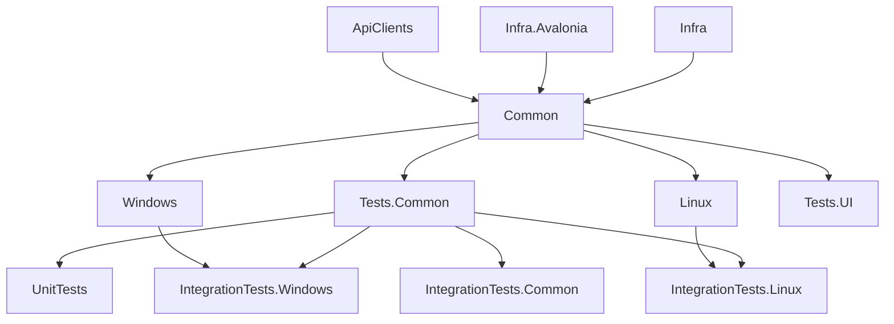

# COMPASS - Architecture Overview

This document is a high-level map of every major feature and system in COMPASS.

---

## Table of Contents

1. [Solution Structure](#1-solution-structure)
2. [Core Domain Models](#2-core-domain-models)
3. [Tag System](#3-tag-system)
4. [Filtering & Sorting](#4-filtering--sorting)
5. [Metadata & Cover Art](#5-metadata--cover-art)
6. [Import Pipeline](#6-import-pipeline)
7. [Satchel - Import / Export](#7-satchel--import--export)
8. [Layout System](#8-layout-system)
9. [Collection Management](#9-collection-management)
10. [Tabs](#10-tabs)
11. [Storage & Persistence](#11-storage--persistence)
12. [Preferences & Settings](#12-preferences--settings)
13. [Tools](#13-tools)
14. [Update System](#14-update-system)
15. [API Clients](#15-api-clients)
16. [UI Infrastructure](#16-ui-infrastructure)
17. [Progress Reporting & Background Tasks](#17-progress-reporting--background-tasks)

## 1. Solution Structure

| Project | Purpose |
|---|---|
| `COMPASS.Infra` | Code infrastructure you could find in any dotnet application such as extension methods on dotnet primitives, logging, notification, progress reporting, etc. No UI or domain logic. |
| `COMPASS.Infra.Avalonia` | Avalonia-specific infrastructure: drag-drop helpers, extension methods. |
| `COMPASS.ApiClients` | Typed HTTP API clients for all external services (GitHub, COMPASS backend). Each API lives in its own sub-folder with owned request/response models and an interface for mocking. HTTP client lifetimes and DI registrations are managed by `ApiClientsModule`. |
| `COMPASS.Common` | All application logic: models, view-models, services, sources, repositories. Platform-agnostic. |
| `COMPASS.Windows` | Windows entry point & platform service implementations (update service, IO, shell open). |
| `COMPASS.Linux` | Linux entry point & platform service implementations. |
| `COMPASS.Tests.*` | Test projects (unit, integration, UI). |

Dependency injection is handled through `ServiceResolver` (a thin static wrapper around whatever DI container each platform registers). Platform-specific bindings are registered in each platform's `DependencyInjection` module; cross-platform bindings live in `COMPASS.Common/DependencyInjection/CommonModule.cs`. View-model creation, lifetimes, and the `ServiceResolver` boundaries are documented in [MVVM.md](MVVM.md).



## 2. Core Domain Models

**Key files:** `Source/COMPASS.Common/Models/`

| Model | Description |
|---|---|
| `Codex` | A single item in the collection (book, PDF, URL, etc.). Holds all metadata (title, authors, publisher, release date, rating, tags, sources) plus paths to its cover art and thumbnail. Identified within a collection by an `int Id` and globally by a `Guid GlobalId`. |
| `CodexCollection` | A named, self-contained library. Owns `Tag`s and `Codex`'s and a `CollectionInfo` object for per-collection settings. |
| `CollectionInfo` | Per-collection configuration: folders to auto-import, banished file paths, and per-filetype import preferences. |
| `SourceSet` | Attached to a `Codex`; records every source the item can be found at (local file path, URL, ISBN, etc.). |
| `Tag` | Hierarchical label with a name, optional color (inherits from parent when unset), and a tree of child `Tag` objects. |
| `Folder` | Represents a file-system folder that can be linked to auto-import and to tags. Recursively exposes sub-folders. |

## 3. Tag System

**Key files:** `Source/COMPASS.Common/Models/Tag.cs`, `ViewModels/SidePanels/TagsPanelVM.cs`, `ViewModels/Modals/Edit/TagEditViewModel.cs`, `Views/SidePanels/TagsSidePanel.axaml`

Tags form a tree. Each `Tag` has:
- An `Id` (unique within its collection)
- A `Name` and computed `LongName` (`Grandparent > Parent > Name`)
- An optional `InternalBackgroundColor`; if `null`, the tag inherits the parent's color
- A `Children` collection of nested tags

The Tags side panel lets users browse and toggle tags to filter the current view. Tags can be edited (create / rename / recolor / reparent / delete) via `TagEditViewModel`. A `TagFilter` can be added to the filter bar from the tag panel.

The `FolderTagLink` feature (stored in `CollectionInfo`) automatically applies a specific tag to all items imported from a given folder.

## 4. Filtering & Sorting

**Key files:** `Source/COMPASS.Common/Models/Filters/`, `Services/FilterService.cs`, `Interfaces/Services/IFilterService.cs`, `ViewModels/Main/FiltersViewModel.cs`, `Views/SidePanels/FiltersSidePanel.axaml`

The actual filtering and sorting logic lives in `FilterService` (behind `IFilterService`, registered in `CommonModule`), keeping it reusable and testable without a view-model. It exposes two operations:

- `FilterCodices(codexVms, filtersState)` — applies a `FiltersState` to a codex list and returns the matches.
- `SortCodices(codexVms, sortProperty, sortDirection)` — sorts a codex list in place.

`FiltersViewModel` is the thin UI layer on top. It maintains two independent filter lists, **Included** (must match) and **Excluded** (must not match), each a collection of `Filter` objects. It serialises them to a `FiltersState` (`GetFiltersState()`) and hands it to `FilterService.FilterCodices`; the result is exposed as the single `FilteredCodices` view (included minus excluded). Filtering re-runs whenever the filter lists or the underlying codex data change, and sorting is re-applied on the same service whenever `SortProperty` or `SortDirection` changes.

Each `Filter` subclass targets a specific property:

| Filter | What it checks |
|---|---|
| `TagFilter` | Codex has a specific tag |
| `AuthorFilter` | Author name matches |
| `PublisherFilter` | Publisher matches |
| `SearchFilter` | Full-text search across several fields |
| `MinimumRatingFilter` | Rating is at or above a threshold |
| `StartReleaseDateFilter` / `StopReleaseDateFilter` | Release date range |
| `FileExtensionFilter` | File extension matches |
| `OnlineSourceFilter` / `OfflineSourceFilter` | Has online / offline source |
| `DomainFilter` | URL domain matches |
| `FavoriteFilter` | Item is marked as a favourite |
| `HasBrokenPathFilter` | Local file path no longer exists |
| `NotEmptyFilter` | A given property is not empty |
| `PhysicalSourceFilter` | Has a physical (non-digital) source |

Filters can be dragged from the filters side panel or from the tag/metadata panels into the include or exclude drop zones. A `FiltersState` (two plain `List<Filter>`) can be serialised to persist a tab's filter state.

### Tag filter semantics

Tag filters are special-cased in `FilterService`. For **included** tag filters, tags within the same tag *group* are combined with **OR** while different groups are combined with **AND**, and a tag also matches any parent or child tags. For **excluded** tag filters, any codex carrying the tag *or any of its descendants* is removed.

---

## 5. Metadata & Cover Art

**Key files:** `Source/COMPASS.Common/Sources/`, `Services/CoverService.cs`, `Models/CodexProperties/`, `Models/Enums/MetaDataSourceType.cs`

### Metadata Sources

Every source implements `MetaDataSource` and is identified by a `MetaDataSourceType` flag:

| Source | Type |
|---|---|
| `FileMetaDataSource` | Reads file-system attributes |
| `PdfMetaDataSource` | Reads embedded PDF metadata |
| `ImageMetaDataSource` | Reads EXIF/image metadata |
| `ISBNMetaDataSource` | Looks up book data by ISBN via an external API |
| `GmBinderMetaDataSource` | Scrapes GM Binder pages |
| `HomebreweryMetaDataSource` | Scrapes Homebrewery pages |
| `GoogleDriveMetaDataSource` | Reads Google Drive file metadata |
| `GenericOnlineMetaDataSource` | Falls back to Open Graph / page title for any URL |

Metadata sources are registered keyed by `MetaDataSourceType` and resolved via `IIndex<MetaDataSourceType, MetaDataSource>`, so new sources only need a registration line — see [MVVM.md](MVVM.md) for the factory/DI conventions.

### CodexProperty & Overwrite Rules

`CodexProperty` (in `Models/CodexProperties/`) represents a single importable field (title, author, rating, cover, etc.). Each property carries a `MetaDataOverwriteMode`:
- **Always** - overwrite any existing value
- **IfEmpty** - only write if the field is currently blank
- **Never** - never overwrite
- **Ask** - prompt the user (`ChooseMetaDataViewModel`)

The order of source types to try is stored in `CodexProperty.SourcePriority`, which the user can reorder in settings.

### Cover Art

`CoverService` iterates the source priority list, calls `MetaDataSource.FetchCover`, and hands the result to `CoverStorageService`, which saves both a full-resolution cover and a 200 px thumbnail (stored under the app data directory, named by `GlobalId`).

## 6. Import Pipeline

**Key files:** `Source/COMPASS.Common/ViewModels/Import/`, `ViewModels/Modals/Import/`, `ViewModels/SidePanels/AddCodexPanelVM.cs`

The Add Codex side panel (`AddCodexPanelVM`) is the main entry point for adding items. It dispatches to `ImportViewModel.Import(ImportSource)`. The import sources cover:
- Individual files / drag-drop
- A folder (via `ImportFolderWizardVm` - walks the directory, filters by `CollectionInfo.FiletypePreferences`, respects `BanishedPaths`)
- A URL
- A barcode scan (`BarcodeScanWindow`)
- A Satchel file (delegates to `ImportExportService`)

After creating a bare `Codex`, the pipeline calls `CoverService.GetAndApplyCover` and then runs each enabled `MetaDataSource` in priority order to fill in as many fields as possible.

Auto-import (`CollectionInfo.AutoImportFolders`) re-runs the folder import on startup for every registered folder, automatically picking up new files.

## 7. Satchel - Import / Export

**Key files:** `Source/COMPASS.Common/Services/Storage/ImportExportService.cs`, `Models/SatchelInfo.cs`, `Docs/Satchels.md`

A `.satchel` file is a renamed ZIP archive. See [`Satchels.md`](Satchels.md) for the full format specification.

`ImportExportService` handles both directions:
- **Export** (`ExportCollectionViewModel`): serialises selected codices, tags, collection info, cover art, thumbnails, and optionally the physical files into a ZIP.
- **Import** (`ImportCollectionViewModel`): reads and version-checks `SatchelInfo.json`, deserialises the XML files, and merges into the target `CodexCollection`.

## 8. Layout System

**Key files:** `Source/COMPASS.Common/ViewModels/Layouts/`, `Views/Layouts/`, `Models/Preferences/*LayoutPreferences.cs`

COMPASS supports four layouts, each with its own view and view-model pair:

| Layout | ViewModel | View |
|---|---|---|
| Home | `HomeLayoutViewModel` | `HomeLayout.axaml` |
| List | `ListLayoutViewModel` | `ListLayout.axaml` |
| Card | `CardLayoutViewModel` | `CardLayout.axaml` |
| Tile | `TileLayoutViewModel` | `TileLayout.axaml` |

All layouts extend `LayoutViewModel`, which holds the filtered codex list from `FiltersViewModel` and exposes the active sorting configuration.

Each layout has a corresponding `*LayoutPreferences` model that persists user choices (visible columns, card size, etc.) via `Preferences`.

## 9. Collection Management

**Key files:** `Source/COMPASS.Common/Services/StateManagers/CollectionManager.cs`, `ViewModels/Main/CodexCollectionVM.cs`, `Repositories/CodexCollectionXmlRepository.cs`

`CollectionManager` is an instance singleton registry of all discovered collections. On startup it calls `DiscoverCollections()`, which scans the user data directory for collection folders and creates a `CodexCollectionVM` for each.

`CodexCollectionVM` wraps a `CodexCollection` and manages its lifecycle: loading from / saving to the repository, and providing the `FiltersViewModel` and layout view-models for the tab that shows it.

Data access goes through `ICodexCollectionRepository`. The default implementation (`CodexCollectionXmlRepository`) serialises to XML using `XmlService`. A `CodexCollectionMemRepository` (in-memory) is used in tests and for temporary collections like those extracted from a satchel.

## 10. Tabs

**Key files:** `Source/COMPASS.Common/ViewModels/Main/TabsViewModel.cs`, `ViewModels/Main/CollectionTabVM.cs`

`TabsViewModel` is a singleton that manages a list of open `CollectionTabVM` instances. Each tab is independently bound to a collection and carries its own `FiltersViewModel`, so filters set in one tab do not affect another.

Closed tabs are pushed onto a `Stack<TabState>`, allowing re-open ("undo close tab"). A `TabState` stores the collection identifier and the serialised `FiltersState` so the exact filter state is restored.

## 11. Storage & Persistence

**Key files:** `Source/COMPASS.Common/Services/FileSystem/`, `Services/Storage/`, `Repositories/`, `Interfaces/Storage/`

| Service / Interface | Responsibility |
|---|---|
| `IApplicationDataService` / `ApplicationDataService` | Resolves the root user-data path. Supports a redirect file (`data_location.redirect`) so users can point COMPASS at a cloud-synced folder. |
| `IUserFilesStorageService` / `UserFilesStorageService` | CRUD for collection folders (create, rename, delete, enumerate). |
| `ICoverStorageService` / `CoverStorageService` | Save, load, and delete cover art and thumbnails on disk. |
| `IImportExportService` / `ImportExportService` | Read and write `.satchel` archives. |
| `XmlService` | Thin wrapper around `System.Xml.Serialization` used by the XML repository. |
| `IIOService` / `IOService` | Platform-agnostic file copy/move/delete operations. |

The `StorageStrategy` enum (`Xml` or `Memory`) determines which `ICodexCollectionRepository` implementation is used when constructing a `CodexCollectionVM`.

## 12. Preferences & Settings

**Key files:** `Source/COMPASS.Common/Models/Preferences/Preferences.cs`, `Services/PreferencesService.cs`, `ViewModels/Modals/SettingsViewModel.cs`

`Preferences` is the single serialised settings object. Notable sections:

| Property | Purpose |
|---|---|
| `OpenCodexPriority` | Ordered list of strategies for opening an item (online first or local first). |
| `ImportableCodexProperties` | List of `CodexProperty` objects, each carrying its `MetaDataOverwriteMode` and `SourcePriority`. |
| `*LayoutPreferences` | Per-layout UI settings. |
| `UIState` | Transient UI state that should survive a restart (e.g. last active layout). |
| `AutoLinkFolderTagSameName` | Whether folders with the same name as a tag are automatically linked. |

`PreferencesService` is a singleton that loads/saves `Preferences` to disk (JSON) and exposes it application-wide.

## 13. Tools

**Key files:** `Source/COMPASS.Common/ViewModels/Tools/`, `ViewModels/Modals/ToolsViewModel.cs`

Tools are surfaced from the main menu. Each tool implements `IToolViewModel` and is registered in `ToolsViewModel`.

| Tool | ViewModel | Description |
|---|---|---|
| Backup & Restore | `BackupToolViewModel` | Zips the entire user-data directory to a file, or restores from a backup ZIP. |
| Broken File References | `BrokenFileRefsToolViewModel` | Scans all codices for local file paths that no longer exist and offers bulk-fix options. |

## 14. Update System

**Key files:** `Source/COMPASS.Common/Services/StateManagers/UpdateManager.cs`, `Services/UpdateServiceBase.cs`, `Infra/Interfaces/Services/IUpdateService.cs`, `Docs/Updates.md`

COMPASS checks the `DSPAUL/COMPASS` GitHub releases for versions newer than the running one. `UpdateManager` runs the check on startup and then on a 6-hour timer. It calls `IUpdateService.CheckForUpdates(includePrerelease)` and hands the results to `IUpdateService.OnUpdatesFound()`, which downloads the installer in the background (verifying its SHA256), shows a modal "Update Available" dialog with the changelog, and on confirmation calls `IUpdateService.HandleUpdate()`.

The shared logic lives in `UpdateServiceBase`; the concrete install behaviour is platform-specific and registered per platform: Windows launches the Inno Setup installer (`COMPASS_Setup_{version}.exe`) with `/SILENT` and shuts down the app, while Linux just opens the release page in the browser. Checking is governed by `UpdatePreferences` (`CheckForUpdates`, `IncludePrerelease`, `NotifiedUpdates`), and a title-bar Update button appears while an update is available. See [`Updates.md`](Updates.md) for the full description.

## 15. API Clients

**Key files:** `Source/COMPASS.ApiClients/`

All external HTTP integrations live in the `COMPASS.ApiClients` project. Each API gets its own sub-folder containing:

- A **typed client** class (e.g. `CompassApiClient`, `GitHubApiClient`) with one method per endpoint.
- A **`Models/`** folder with request/response DTOs owned by that integration.
- A public **interface** (e.g. `ICompassApiClient`, `IGitHubApiClient`) so consumers can depend on the abstraction and tests can inject mocks.

HTTP client lifetimes are managed via `IHttpClientFactory`. Named clients and their default headers are configured once in `ApiClientsModule` (located in `COMPASS.ApiClients/DependencyInjection/`), which is loaded by `CommonModule`.

| Client | Interface | Endpoints |
|---|---|---|
| `CompassApiClient` | `ICompassApiClient` | `POST /submit/crash` — submits an anonymous crash report |
| `GitHubApiClient` | `IGitHubApiClient` | `GET /repos/{owner}/{repo}/releases` — fetches release list |

## 16. UI Infrastructure

**Key files:** `Source/COMPASS.Common/Services/StateManagers/WindowManager.cs`, `Services/NotificationService.cs`, `Tools/Logging/`, `Tools/CrashHandler.cs`

| Component | Description |
|---|---|
| `WindowManager` | Tracks the currently active top-level `Window` so services can show dialogs without a direct reference. |
| `NotificationService` | Shows toast notifications and modal dialogs using `NotificationWindow` and `ModalWindow`. |
| `CompositeLogger` | Combines `FileLogger` (writes to a rolling log file) and `UILogger` (feeds the in-app Logs side panel) behind the `ILogger` interface. |
| `CrashHandler` | Hooks `AppDomain.UnhandledException` and `TaskScheduler.UnobservedTaskException`, logs the crash, and sends an opt-in crash report via `ICompassApiClient`. |
| `WebDriverService` | Creates Selenium `WebDrivers` used by online metadata sources that require JavaScript rendering. |
## 17. Progress Reporting & Background Tasks

**Key files:** `COMPASS.Infra/Models/Progress/` (`ProgressTracker.cs`, `IProgressReport.cs`), `COMPASS.Infra/Models/Measuring/` (`Quantity.cs`, `Quantities.cs`, `Unit.cs`), `COMPASS.Infra/Tools/` (`UiSynchronizationContext.cs`), `COMPASS.Infra/Tools/Logging/` (`LoggerScope.cs`, `ScopedForwardingLogger.cs`), `Source/COMPASS.Common/Services/StateManagers/ProgressTrackingManager.cs`, `ViewModels/ProgressViewModel.cs`, `App.axaml.cs` (registers the UI context), `Views/Main/MainView.axaml` (bottom bar), `Views/Windows/ProgressWindow.axaml(.cs)`

Long-running work (metadata fetch, cover fetch, auto-import, satchel import/export, backup/restore, data-folder copy) runs as plain `async`/`await` at the call site and reports through a `ProgressTracker`. 

### Building blocks

| Type | Role |
|---|---|
| `ProgressTracker` | Per-operation state: `Total`, `Progress`, `StatusMessage`, and a capped `MessageLog` (`MaxLogEntries`, default 500). Derives `Fraction` (`null` while the total is unknown), `Percentage`, `IsIndeterminate`, and `IsComplete`. Thread-safe (`Lock`-protected) and marshals notifications and log appends to the UI thread via the registered `UiSynchronizationContext` (see below), so it works no matter which thread constructs it or reports to it — `ConfigureAwait(false)` and `Parallel.ForEachAsync` reporters included. Implements `ILogger`, so it can be a log sink directly (`Info`/`Warn`/`Error` append to `MessageLog`; `Debug` is suppressed as too verbose for the UI). Also implements `IProgress<ProgressReport>` (SharpCompress), so a tracker can be passed straight into SharpCompress `ReaderOptions`/`ZipWriterOptions` as `Progress = tracker` for byte-level zip progress. |
| `UiSynchronizationContext` | Static holder for the app-wide UI `SynchronizationContext`, registered once in `App.OnFrameworkInitializationCompleted` (which runs on the UI thread on every platform). `ProgressTracker` resolves its marshal target through here, falling back to the ambient context when nothing is registered (keeps unit tests synchronous). This is what frees call sites from any thread affinity: trackers may be constructed on pool threads (e.g. the import pipeline after `ConfigureAwait(false)`) and still notify safely. |
| `IProgressReport` / `ProgressReports` | The vocabulary for reporting: `XOutOfY(value, total)`, `Percentage(fraction)` (0–1), `Status(message)`, `Log(entry)`, `Increment` (shared singleton, safe for `Parallel.ForEachAsync`), `Completed`. Inner services accept `IProgress<IProgressReport>?` so callers can pass a tracker without coupling to it. |
| `Quantity` / `Quantities` / `Unit` | The unit of what is being counted, used for display formatting. `Quantities.Items(name)` for counted work (metadata, covers) — also used without a total for indeterminate work (backup compression, auto-import scan); `Quantities.FileSize` for byte-based work (satchel import/export via SharpCompress); `Quantities.Items("Files")` for the data-folder copy. |
| `ProgressTrackingManager` | Singleton registry (registered in `CommonModule`). `RunAsync(tracker, title, work)` tracks the operation, installs the tracker as the ambient logger (see below), invokes `work(tracker, ct)`, and untracks in a `finally`. `Track`/`Untrack`/`GetSnapshot` manage `TrackedOperation`s; `TrackingChanged` notifies the UI. Each operation owns a `CancellationTokenSource` linked to a global one, so `TrackedOperation.Cancel()` stops one task while `CancelAll()` stops everything. |
| `TrackedOperation` | One entry in the registry: `Tracker` + `Title` + `CancellationToken` + `Cancel()`. `ProgressWindow` binds to a single instance of this. |
| `LoggerScope` + `ScopedForwardingLogger` | `LoggerScope` is an `AsyncLocal<ILogger?>` ambient slot — it flows across `await`, `Task.Run`, and `Parallel.ForEachAsync` bodies. `RunAsync` installs the tracker via `LoggerScope.Use(tracker)`. The injected `ILogger` is decorated with `ScopedForwardingLogger` (see `CommonModule`), which forwards every log to the permanent Serilog pipeline **and**, when a scope is active, into the tracker's `MessageLog` (`Info` stays scope-local; `Debug`/`Warn`/`Error`/`Fatal` go to both). Service code therefore needs no progress plumbing: plain `logger.Info(...)` calls inside a tracked operation automatically appear in the progress UI. Always pair `Use` with `using`/`Dispose` so the scope never leaks into unrelated work. |

### Call-site pattern

```csharp
ProgressTracker progressTracker = new(Quantities.Items()) { Total = codices.Count };

try
{
    await progressTrackingManager.RunAsync(progressTracker, "Getting metadata...",
        async (tracker, ct) =>
        {
            await Parallel.ForEachAsync(codices, new ParallelOptions { CancellationToken = ct },
                async (codex, ct) =>
                {
                    try { await GetMetadata(codex, ct); }
                    finally { tracker.Report(ProgressReports.Increment); }
                });
        });
}
catch (OperationCanceledException)
{
    logger.Info("Fetching metadata has been cancelled");
}
```

Notes:
- Leave `Total` unset for indeterminate work (backup compression, auto-import scan) — the UI shows a spinner via `IsIndeterminate` until a total is reported.
- Leaf services take `IProgress<IProgressReport>? progress = null, CancellationToken ct = default` (e.g. `WebService.DownloadFileAsync` reports `XOutOfY`; `IOService.CopyDataAsync` reports `XOutOfY(0, n)` then `Increment` per file). Cancellation is cooperative: honour the passed token and let `OperationCanceledException` propagate to the `RunAsync` caller, which logs the cancellation.
- Call sites have no thread affinity: the tracker resolves its marshal target from the registered `UiSynchronizationContext`, so construction and reporting from pool threads (import pipeline, `Parallel.ForEachAsync` workers) is safe.

### UI wiring

| Component | Description |
|---|---|
| `ProgressViewModel` | Singleton UI mirror of the manager. Maintains `TrackedOperations`, derives `PrimaryOperation` (the most recent), and exposes `HasActivity`, `DisplayText` (`Title` plus `StatusMessage` when set), `Percentage`, `IsIndeterminate`, `CancelPrimaryCommand`, and `CancelAllCommand`. Subscribes to `TrackingChanged` and each tracker's `PropertyChanged`, marshalling refreshes via `Dispatcher.UIThread`. |
| Bottom bar (`MainView.axaml`) | Binds to `MainViewModel.TasksVM`: visible while `HasActivity`, shows `DisplayText`, a progress bar (`Percentage` / `IsIndeterminate`), and a cancel button (`CancelPrimaryCommand`). |
| `ProgressWindow` | Detail view bound to one `TrackedOperation`: `Title`, `Tracker.StatusMessage`, `Tracker.Percentage`, `Tracker.IsIndeterminate`, and the severity-coloured `Tracker.MessageLog` (auto-scrolls on new entries). Close only hides the window; the dedicated cancel button calls `TrackedOperation.Cancel()`. |
