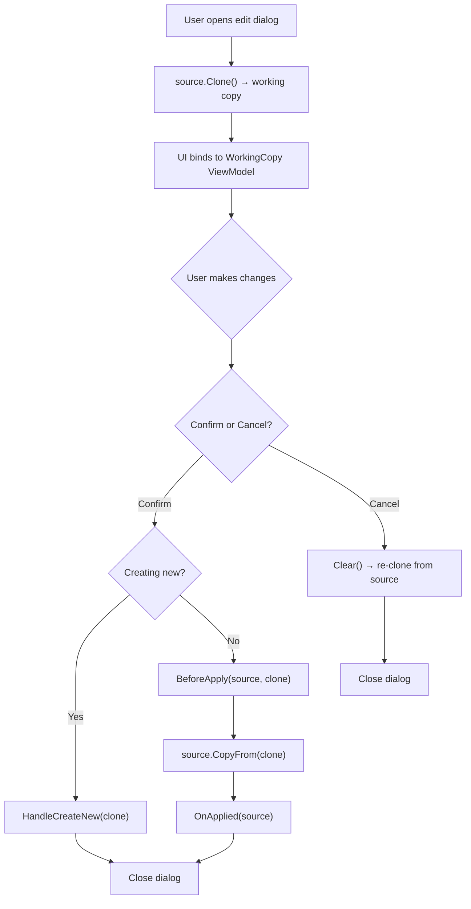

# Edit Pattern – Clone, Edit, Apply / Cancel

## Design Principle

When the user opens an edit dialog (for a codex, tag, or collection info), COMPASS **never mutates the original model directly**. Instead, it follows a clone-based editing pattern:

> **Clone** the source model → bind the UI to the clone → on **Confirm**, copy the clone's data back to the source → on **Cancel**, discard the clone.

This guarantees that partially edited or invalid data never leaks into the live collection. The user can freely make changes, trigger validation, and undo mistakes — nothing is committed until they explicitly confirm.

## The `ICloneable<T>` contract

**File:** `Infra/Models/Interfaces/IClonable.cs`

Every editable model implements `ICloneable<T>`, which declares just two methods:

| Method | Purpose |
|---|---|
| `Clone()` | Creates a deep copy of the model. Used at the start of editing to create the working copy. |
| `CopyFrom(source)` | Overwrites all properties of `this` with values from `source`. Used on confirm to apply the working copy back to the original. Because `CopyFrom` writes to the original model via its setters, `PropertyChanged` fires naturally — the MVVM data-flow (see [MVVM.md](MVVM.md)) takes care of updating the UI everywhere else. |

## `EditViewModelBase<TViewModel, TModel>`

**File:** `ViewModels/Modals/Edit/EditViewModelBase.cs`

This is the generic base class for all edit dialogs. It orchestrates the full clone → edit → apply/cancel lifecycle.

### Construction

1. Stores a reference to the **original** model (`_source`).
2. Calls `source.Clone()` to create a **working copy**.
3. Wraps the clone in a full ViewModel so the UI gets validation, derived properties, and all the `ModelViewModelBase` machinery.
4. Subscribes to the working copy's `PropertyChanged` to update `CanConfirm` whenever validation state changes.

### The lifecycle

### Abstract hooks

Subclasses implement three methods to customise behavior for their specific model:

| Method | Called when | Purpose |
|---|---|---|
| `HandleCreateNew(newObj)` | Confirm + `createNew = true` | Add the new object to the collection. |
| `BeforeApply(source, proposal)` | Confirm + `createNew = false` | Perform any structural changes before the data is copied (e.g. update bidirectional relations now that you still have a reference to the other object). |
| `OnApplied(source)` | After `CopyFrom` completes | Trigger side effects like saving to disk or renaming. |

### Confirm and Cancel

On **Confirm**, the working copy's model is read and either `HandleCreateNew` (when creating) or `BeforeApply` → `CopyFrom` → `OnApplied` (when editing) is invoked — `CopyFrom` is where the real model gets updated. The working copy is then cleared and the dialog closes.

On **Cancel**, the working copy is simply cleared (re-cloned from the source, discarding all changes) and the dialog closes.

`CanConfirm` checks the working copy's `INotifyDataErrorInfo.HasErrors` — the confirm button is disabled while validation errors exist.

### Clear / Reset

`Clear()` re-creates the working copy from the original source, effectively resetting all changes. It runs on both confirm and cancel.

## Concrete edit view-models

### `CodexEditViewModel`

**File:** `ViewModels/Modals/Edit/CodexEditViewModel.cs`

Edits a single `Codex`. On confirm:
- **New:** adds the codex to `Collection.AllCodices`.
- **Edit:** `CopyFrom` updates the original, then saves the collection.

Also handles browsing for file paths, fetching metadata, and loading cover art — all operating on the working copy, never the original.

### `TagEditViewModel`

**File:** `ViewModels/Modals/Edit/TagEditViewModel.cs`

Edits a single `Tag`. Has extra logic in the hooks:
- **`HandleCreateNew`**: assigns a unique ID, adds to `AllTags`, inserts into the parent's `Children` (or `RootTags`), and calls `TagsChanged()`.
- **`BeforeApply`**: if the parent changed, removes the tag from its old parent's children list before `CopyFrom` re-parents it.
- **`OnApplied`**: re-inserts into the new parent's children and calls `TagsChanged()`.

### `CollectionEditViewModel`

**File:** `ViewModels/Modals/Edit/CollectionEditViewModel.cs`

Edits `CollectionInfo` (and optionally the collection name). On confirm:
- **New:** creates a new collection via `CollectionManager` and switches the active tab to it.
- **Edit:** applies info changes via `CopyFrom`, then renames the collection if the name changed.

### `CodexBulkEditViewModel`

**File:** `ViewModels/Modals/Edit/CodexBulkEditViewModel.cs`

The exception to the pattern — does **not** extend `EditViewModelBase` because it operates on multiple codices at once. Instead, it finds common values across the selection and applies only the changed fields to each codex on confirm.

## Why this pattern matters

1. **Atomicity** — changes are all-or-nothing. No half-edited state is visible to the rest of the application.
2. **Validation before commit** — the working copy is validated continuously; the confirm button is gated on `HasErrors`.
3. **Seamless MVVM integration** — `CopyFrom` writes through the model's setters, which triggers `PropertyChanged`, which `ModelViewModelBase` forwards to the UI. Every view bound to the original model updates automatically after confirm.
4. **Reusability** — the generic base class handles the entire lifecycle; subclasses only provide the three hooks for their domain-specific logic.
