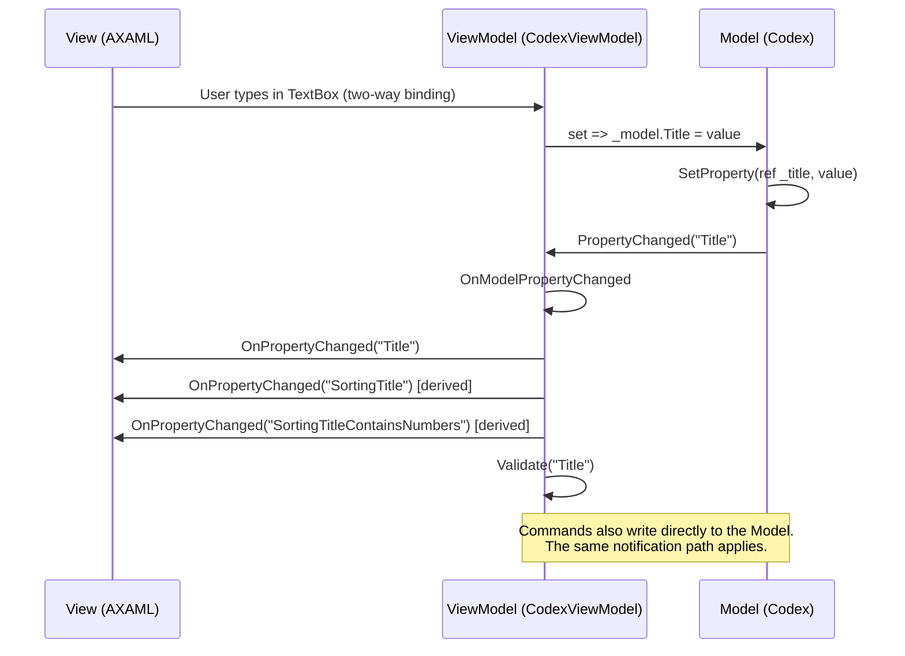

# MVVM Implementation & Data Flow

## Design Principle

COMPASS follows a strict **Model-first** MVVM approach:

> Commands mutate the **Model** → the Model raises `PropertyChanged` → the **ViewModel** captures it, validates, and re-raises `PropertyChanged` → the **View** updates via binding.

This means the Model is always the source of truth, and the ViewModel is a projection of it that adds UI concerns (validation, derived properties, formatting).

## Key base classes

### `ViewModelBase`

**File:** `ViewModels/ViewModelBase.cs`

All view-models inherit from this. It provides:

| Feature | Description |
|---|---|
| `INotifyDataErrorInfo` | Built-in validation infrastructure with per-property error tracking. |
| `AddValidation(propertyName, validator)` | Registers a validation method for a property. Called automatically when that property changes. |
| `Validate(propertyName)` | Clears previous errors, runs the validator, and if the VM implements `IConfirmable`, updates the confirm button's `CanExecute`. |
| `ActiveCollection` | Convenience property to reach the current tab's `CodexCollection`. |

### `ModelViewModelBase<TModel>`

**File:** `ViewModels/ModelVMs/ModelViewModelBase.cs`

A specialised base for view-models that wrap exactly one model instance. This is where the core data-flow pattern lives:

- Subscribes to the wrapped model's `PropertyChanged`.
- `OnModelPropertyChanged` forwards every change to the UI: it re-raises `PropertyChanged` on the UI thread for the changed property, then for every registered *derived* property, and finally runs `Validate` for that property.
- `GetModel()` exposes the wrapped model.
- `Dispose()` unsubscribes from the model.

## The data-flow in practice



**The critical insight:** The ViewModel setter does _not_ call `SetProperty` or raise `PropertyChanged` itself — it only writes to the model. The notification comes _back_ from the model through `OnModelPropertyChanged`, ensuring there is exactly one notification path regardless of whether the model was changed by the UI, by a command, by an import operation, or by any other code.

## Derived properties

ViewModels often expose computed values that depend on one or more model properties. These are registered in the wrapping view-model's constructor via `_derivedProperties`; `CodexViewModel`, for example, maps `Codex.Title` → `SortingTitle` and `SortingTitleContainsNumbers`, `Codex.Authors` → `AuthorsAsString`, and `Codex.ReleaseDate` → `ReleaseDateAsString`.

When `Codex.Title` changes, `ModelViewModelBase` automatically raises `PropertyChanged` for `SortingTitle` and `SortingTitleContainsNumbers` as well, keeping the UI in sync without manual wiring in every setter.

## Validation

Validation is **property-triggered** and **declarative**: validators are registered in the constructor of the wrapping view-model via `AddValidation(propertyName, validator)` (e.g. `CodexViewModel` validates `PageCount`, `TagViewModel` validates `Name`).

When a property changes, `HandlePropertyChanged` calls `Validate(propertyName)`, which:
1. Clears existing errors for that property.
2. Runs the registered validator (which may call `AddError`).
3. If the VM implements `IConfirmable`, updates the confirm button's enabled state.

The View picks up errors automatically through `INotifyDataErrorInfo` — Avalonia renders validation adorners on bound controls.

## Commands

Commands live on ViewModels but operate on models. `CodexOperations`, for example, is an injectable instance service exposing command logic that takes a `Codex` model (`OpenCodex`, `OpenCodexLocally`).

This ensures the model is always authoritative and the ViewModel never needs to manually synchronise state.

## ViewModel creation: colocated factories

ViewModels that need services are **never constructed with `new`** outside their factory. Each such ViewModel has a colocated `<Name>Factory` class at the bottom of its own file:

```csharp
[Factory]
public class CodexViewModelFactory(ILogger logger, CodexOperations codexOperations)
{
    public CodexViewModel Create(Codex codex, CodexCollectionVM parentCollectionVm)
        => new(logger, codexOperations, codex, parentCollectionVm);
}
```

Rules:

1. **Primary constructor = injected services only; `Create` parameters = runtime data only.** Services are long-lived and come from the container; runtime data (models, parent VMs, ids, flags) is short-lived and comes from the caller. Never mix them.
2. **No interfaces on factories.** Factories are concrete classes; tests construct them directly with mocks (`new CodexViewModelFactory(new MockLogger(), ...)`).
3. **`[Factory]` + auto-registration.** The attribute marks the class for `FactoryRegistrar.RegisterFactories`, which scans the assembly and registers every factory as self (transient, the Autofac default) — called from `CommonModule`, `MockModule`, and the UI test harness. Never register a factory by hand.
4. **Factories hold `Lazy<T>`, VMs take concrete services.** When a creation graph cycles, the `Lazy` lives on the factory and is resolved (`.Value`) inside `Create` — never in the VM constructor. VMs stay directly test-constructible and never know a cycle existed.

## Operations classes

Domain logic that needs services but isn't tied to one ViewModel lives in instance operations services in `Operations/` (`CodexOperations` for codex-level actions, `CodexCollectionOperations` for collection-level actions like import/merge, `TagOperations` for tag deletion). They are registered singletons and injected wherever needed — including into factories, which is what makes the factory graph compose.

The organizing rule: **methods act on the object their class is named for** (`CreateNewCodex(collection)` lives in `CodexCollectionOperations`, everything taking a `Codex` lives in `CodexOperations`). Models themselves stay pure and service-free.

## When `ModelViewModelBase` is NOT used

Not every ViewModel wraps a single model:

| ViewModel | Reason |
|---|---|
| `FilterViewModel` | Filters are immutable value objects — no property changes to forward. Wraps a `Filter` but does not inherit `ModelViewModelBase`. |
| `FiltersViewModel` | Manages a _collection_ of filters, not a single model instance. Inherits `ViewModelBase` directly. |
| `MainViewModel`, `TabsViewModel` | Orchestration VMs with no corresponding single model. |
| `WizardViewModel`, `SettingsViewModel` | Modal/workflow VMs that compose multiple models. |

## Summary of rules

1. **Models own the data** — all state lives in the model, models use `SetProperty` to notify. Models never reference services.
2. **ViewModel setters write through** — `set => _model.X = value`, never `SetProperty` on the VM side for model-backed properties.
3. **One notification path** — Model → `OnModelPropertyChanged` → `HandlePropertyChanged` → UI. No dual-raise.
4. **Derived properties are declared** — registered in the constructor via `_derivedProperties`, auto-notified.
5. **Validation is property-driven** — registered via `AddValidation`, triggered on every property change automatically.
6. **Creation goes through factories** — never `new` a service-needing ViewModel; primary ctor takes services, `Create` takes runtime data.