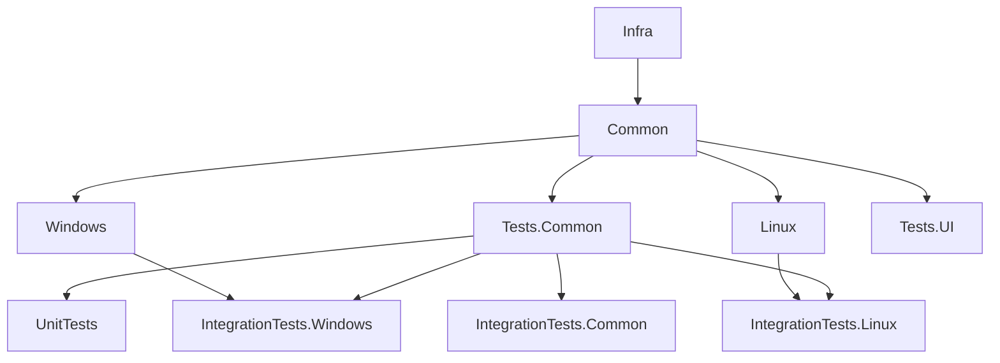

# Project Hierarchy

# Project Details

## Lib

### Infra

For code that could be found in any .NET Avalonia project.

### Common

All code shared between all target platforms.

## Desktop
### Windows, Linux

Entry points for the different platforms, contain platform specific implementations of interfaces. 

## Tests

### Common

Class library for data generators, comparitors, mocks, ect.

### Unit tests

Platform independant unit tests

### IntegrationTest.Common

Platform independant integration tests

### IntegrationTest.Windows & IntegrationTests.Linux

Plaform dependant integration tests

### Test.UI
A simple application to test UI Components

