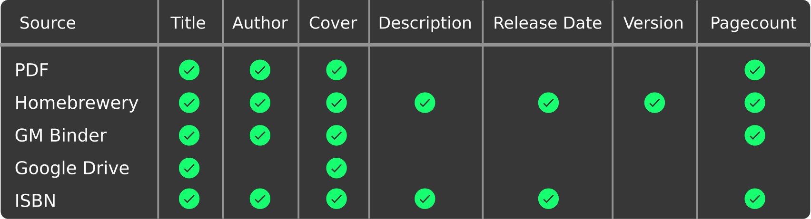
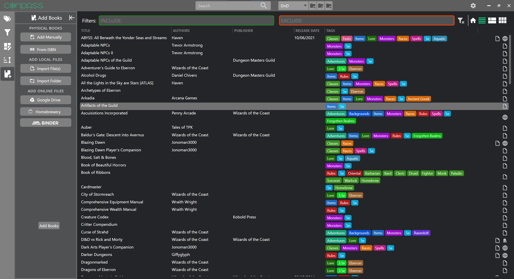
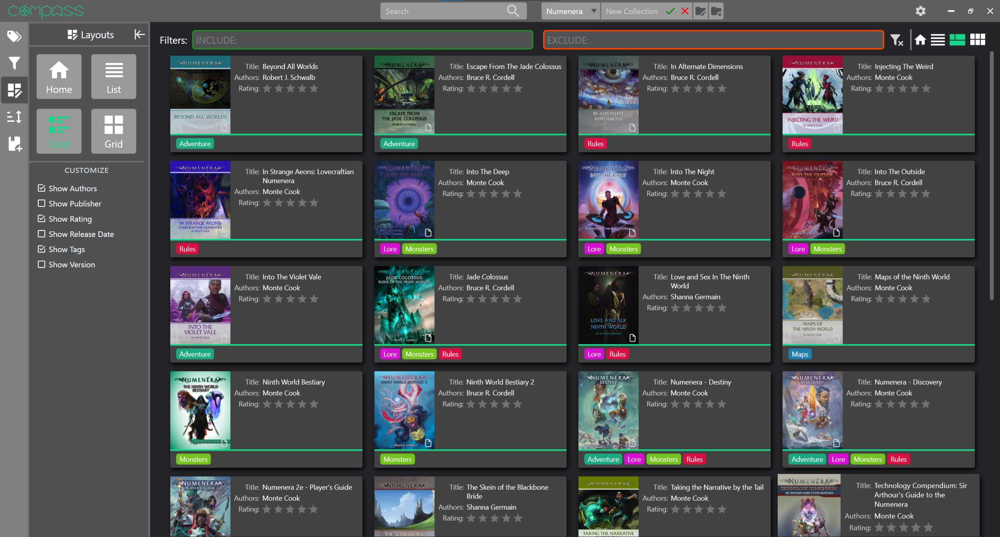
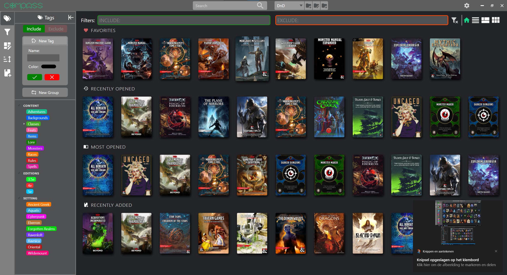
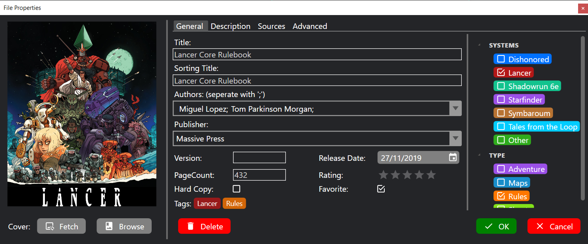

 
 
 

# COMPASS
The Codex Organizer to make Pen-and-paper Adventuring Super Simple or COMPASS for short is a windows application to organize and manage all your TTRPG rulebooks, inspired by [Playnite](https://github.com/JosefNemec/Playnite). You can download the latest version of COMPASS [here](https://github.com/DSPaul/COMPASS/releases/latest).

## :scroll: Story

If you are a fellow TTRPG enthusiast, you probably have lots of pdf's both homebrew and official from sites such as [Drivethrough RPG](https://www.drivethrurpg.com/), [Humble Bundle Books](https://www.humblebundle.com/books),  [GM Binder](https://www.gmbinder.com/), [Homebrewery](https://homebrewery.naturalcrit.com/), [itch.io](https://itch.io/books/genre-rpg) or content from subreddits, patreon creators and kickstarters. Or perhaps you own them in digital form on sites such as [D&D Beyond](https://www.dndbeyond.com/sources#Sourcebooks) or [Roll20](https://roll20.net/compendium/dnd5e/BookIndex). Keeping track of all these books, maps and other resources is hard and nothing is more frustrating than franticly clicking through folders in search of that one statblock you need in the heat of combat.
 
COMPASS solves this problem by bringing all of your resources together in one place that was designed to help you find what you need, thanks to fuzzy search, a robust filter and tagging system and a clean interface with four customizable layouts to choose from, so you only see the information that is important to you.

## :toolbox: Features

- **Unify** your digital tabletop RPG sourcebook library so everything is in one place. You can import files of any type or link to a URL for online sources. You can also manually add books to include your physical collection.
- Have **Redundant Access** to your books by linking your books to both an offline file and an online version hosted on sites such as Google Drive and GM Binder. COMPASS will automatically fallback to another version if the preferred one is unavailable due to a lack of internet for example.
- **Automatic metadata** from PDF's, supported sites and books with an ISBN number thanks to [Open Library](https://openlibrary.org/). 
  
- 

- **Categorize** all your books using Tags. You can add Tags for anything you like, such as:
  - The type of content like *Adventure*, *Monsters* or *Setting/Lore*.
  - The edition or ruleset such as *DnD 5e* or *Pathfinder 2e*.
  - The setting such as *Forgotten realms* or *Eberron*.
  - The Genre such as *Horror*, *Fantasy* or *Sci-Fi*.
  - Whatever works for you, you can create tags for everything.
- **Map** your existing folder structure onto your new tags to get organized quickly.
- **Organize** your tags in groups to retain the advantages of folders, without the need for file duplication.
- **Filter and Sort** all your books by metadata with support for separate sorting titles and negative filters.
- **Visualize** your library with 4 different layouts to choose from: Home, List, Cards and Tiles (see screenshots).
- Have **Quick Access** to your books thanks to the Home view which lists your favorites, recently opened, most opened and recently added books for your convenience.
- **Group** your books into collections. Each collection has their own list of tags, authors, ect. and helps you keep an overview by reducing the amount of books that are on your screen at once.

## :warning: Why am I getting warnings from Windows and Virus scanners when installing COMPASS?

The COMPASS files are not digitally signed which results in these kinds of warnings. Signing code is expensive, requires a bunch of paperwork and is just not worth it for a small project like this. If this project ever takes off and gains a large amount of users, I will look into this again. If you do not trust the executable, you can always build the code from source. To do so, simply clone the repo, install Visual Studio, open the solution file and and either build in release mode or publish.

## :construction: Contributing

I created this project to solve a problem I had and as a learning opportunity. I eventually chose to release it publicly and open source because I believe others might find it useful as well. If you like this project and would like to contribute, there are many ways you can do so.

- If you find a bug, please open a github issue and report it there so it can be fixed. If you don't have a github account, you can also join the [discord](https://discord.gg/HawGMJgS9Y) and share it there. Please include a clear explanation of the nature of the bug and if possible steps to reproduce it.
- If you have ideas for new features or improvements, you can put those in a github issue as well.
- As for code contributions and pull requests, I am not currently looking for contributors. There are many reasons for this but [this video](https://www.youtube.com/watch?v=YIL5fuAUPiA) summarizes it pretty well. If you cannot help yourself however, all pull requests should be made against the dev branch. Dev gets merged into master with every new release.

## :heart: Support the project

If you would like to support the project, you can do so in multiple ways.

- If you have any ideas or suggestion on how to make COMPASS better, you can share those in the [discord](https://discord.gg/HawGMJgS9Y) or in a github issue, it helps a lot.
- Feel free to share this on forums, social media, discord servers ect. if you think it can help others.
- If you would like to financially support me so I can justify spending more time on this, help with potential costs such as code signing or just show some love, you can buy me a coffee over on [ko-fi](https://ko-fi.com/pauldesmul), I would greatly appreciate it.

## :camera: Screenshots

